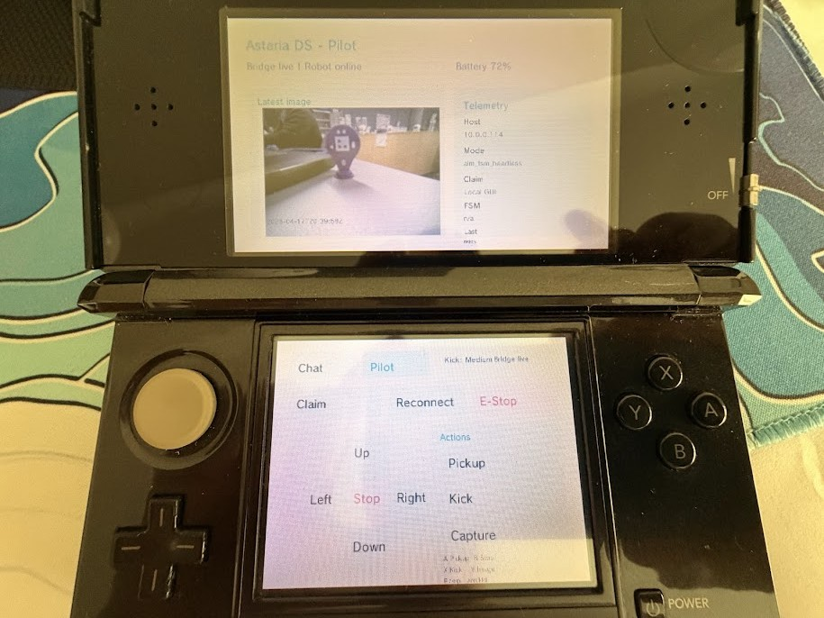

# Asteria DS

Asteria DS is an old-3DS homebrew companion for the [Asteria Command Station](https://github.com/RedLynx101/asteria-command-station). It turns a handheld console into a lightweight robotics controller with teleop, status, vision preview, audio cues, and a prompt surface for the Asteria Desk.



## What It Does

- Connects to the Asteria daemon over the authenticated mobile bridge.
- Shows bridge status, robot host, lease holder, FSM state, and a low-bandwidth camera preview.
- Provides touch and button-driven teleop controls for forward/back, left/right, stop, kick, pickup, and capture.
- Submits short Desk prompts back to Asteria so a human or agent can respond from the command station.
- Uses NDSP audio cues and ROMFS assets for clear handheld feedback.

## Repo Pair

This repo is designed to live beside the host repo when developing locally:

```text
CogRobRepos/
  asteria-command-station/
  asteria-ds/
```

Public repos:

- [RedLynx101/asteria-command-station](https://github.com/RedLynx101/asteria-command-station)
- [RedLynx101/asteria-ds](https://github.com/RedLynx101/asteria-ds)

Generate the private handheld config from the host repo:

```powershell
cd ..\asteria-command-station
python .\scripts\asteria_mobile_setup.py
```

Then copy the generated import config to the 3DS as:

```text
sdmc:/3ds/asteria-ds/config.json
```

Generated tokens are intentionally not included in this public repo.

The host repo is also where live robot dependencies are configured. Asteria DS only talks to the mobile bridge; it does not import VEX AIM or OpenClaw code directly.

## Build

Install devkitPro with 3DS support, then:

```powershell
cd asteria-ds
make
```

Expected local build outputs:

```text
asteria-ds.3dsx
asteria-ds.elf
asteria-ds.smdh
build/
```

Those outputs are ignored by Git. The source, headers, config example, icon, and ROMFS audio assets are tracked.

## Install

Copy the built app folder to the SD card:

```text
sdmc:/3ds/asteria-ds/asteria-ds.3dsx
sdmc:/3ds/asteria-ds/config.json
```

Launch it from the Homebrew Launcher while the Asteria daemon is running on the same trusted network.

## Bridge Contract

The app expects the host daemon to expose:

- `GET /api/mobile/status`
- `GET /api/mobile/images/preview`
- `POST /api/mobile/prompt`
- `POST /api/mobile/teleop/claim`
- `POST /api/mobile/teleop/release`
- `POST /api/mobile/teleop/vector`
- `POST /api/mobile/teleop/stop`
- `POST /api/mobile/teleop/command`
- `POST /api/mobile/images/capture`

Default daemon port: `8766`.

## Current Limits

- Chat is a Desk prompt surface, not a full live mobile agent session.
- Pickup currently maps to the host bridge's practical pickup/kick-style helper, not a full object-aware manipulation routine.
- Camera preview uses cached RGB565 frames generated by the host for the 3DS screen budget.
- The app assumes a trusted LAN and a bearer token generated by Asteria.
